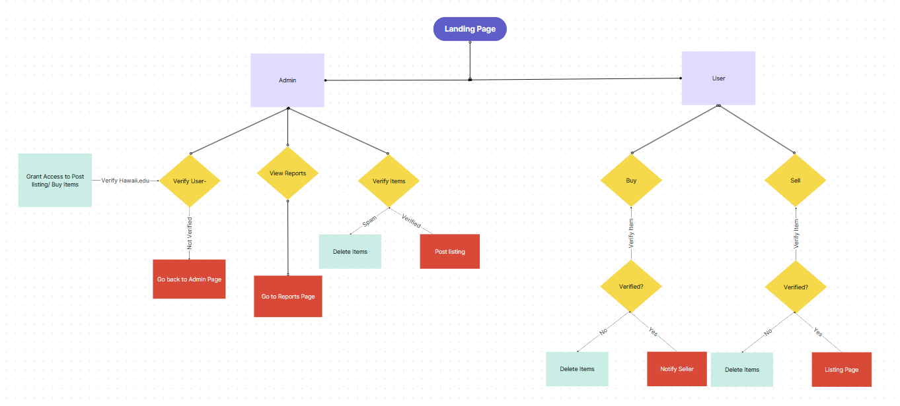
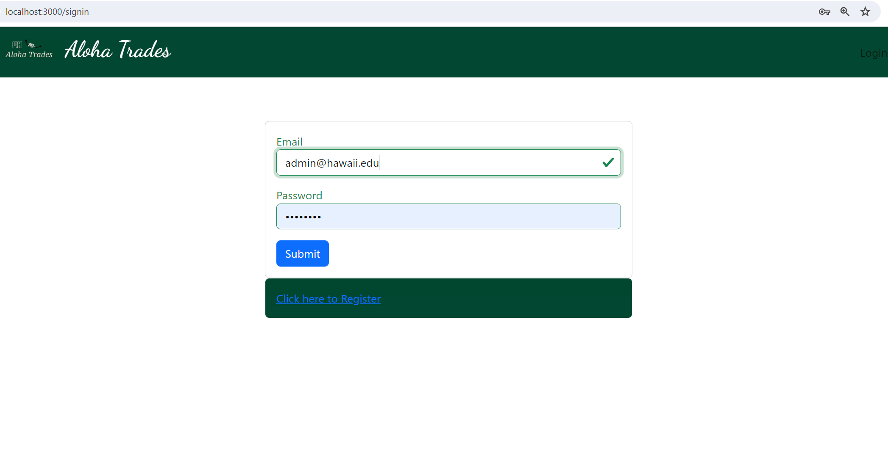
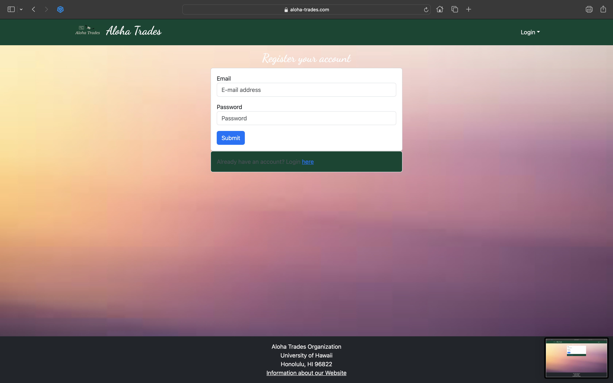
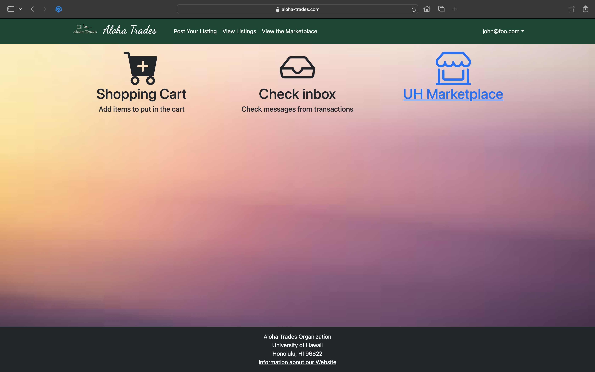
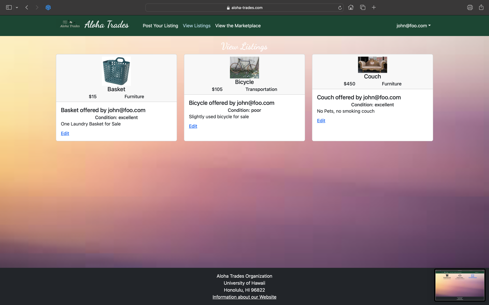
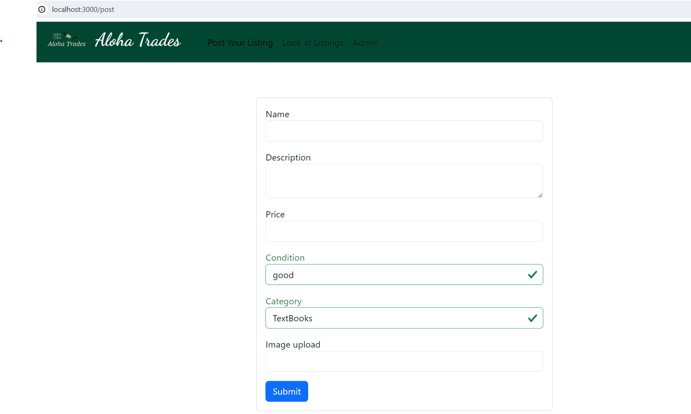
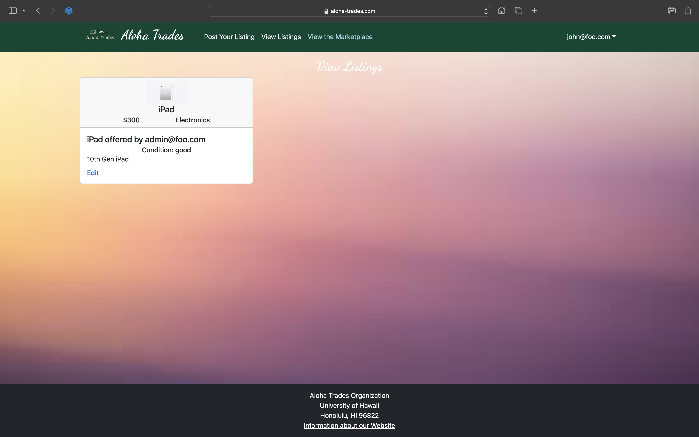
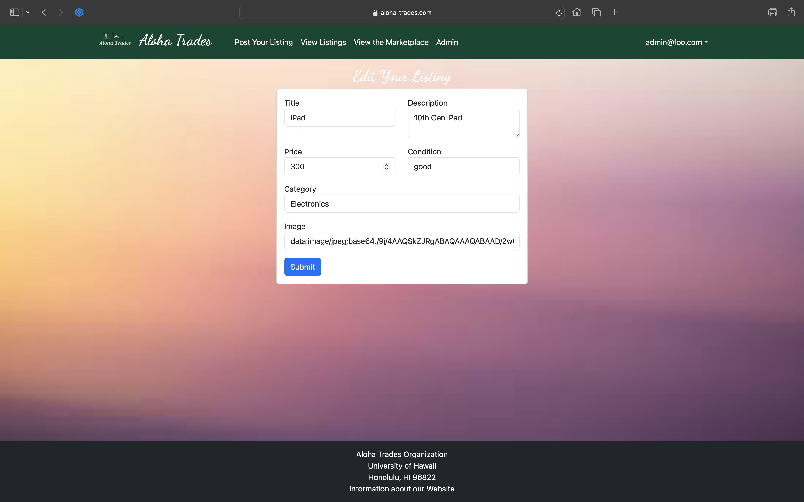
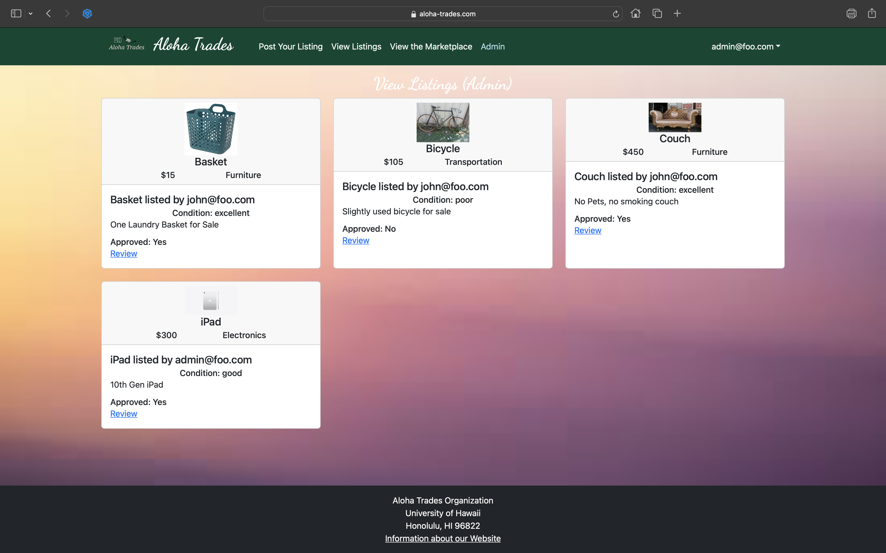

# Aloha Trades
## Overview
**The problem:** UHM students have a “rapid” churn rate in goods and services. Students leave the dorm for an on-campus apartment and need to get rid of dorm-specific stuff and acquire apartment-specific stuff. Students graduate and need to get rid of stuff because they’re moving off-island. There are therefore a tremendous amount of “campus-specific” goods and services that could be more effectively recycled and reused if there was an effective marketplace for these specific kinds of items.

**The solution:** The Aloha Trade is an application for UHM students to facilitate buying and selling of student-related goods and services.  By creating a page for only UHM students, we strive to alleviate the awkwardness of dealing with scammers and bots.  

## User Guide
### Application functionality
In the following section, we will go over functionalities of our page.  In order to help visualize this, the diagram shown below was created:



### Landing page
When you enter our sites url, https://aloha-trades.com, this is what should be displayed. You will have to have a UH account in order to use this website:



The next step is to use the Login menu to either Login to an existing account or register a new account.

### Sign-up/Sign-in page
Alternatively, clicking on the Login link, then on the Sign Up menu item displays this page:



### Landing (after Login) page, non-Admin user
Once you log in (either to an existing account or by creating a new one), the navbar and page changes as follows:



### View Listings Page
After logging in, here is the page that allows you to see the listings you post:



### Post a Listing
After logging in, a user can post a listing. Fields required include: name, description, price, condition, category, and an image upload.  Here is the page that allows you to create a item listing:



### Item Detail Page (Under Construction//M3)
After clicking on an item, this page will show more information about the item and seller.


### View Marketplace
After logging in, you can view listings on the market and profile information like name, contact, and profile image.



The marketplace will not show your listings. In the image the listing is owned by the admin.

Later if you want to edit your listings you can click the "Edit" link to go to the Edit Listing page, shown next.

### Edit Item Page
After clicking on the "Edit" link associated with an item, this page displays that allows you to change and save it:



### NavBar (after Login), Admin user
You can define an "admin" user in the settings.json file. This user, after logging in, gets a special entry in the navbar:


### Admin - Approving Posts
Any listing posted must be approved by an admin.  While this may take time, it ensures quality of the postings on the page.  Also, it helps to keep malicious actors who may be using 'codewords' or suspicious activity down to a minimum (ideally zero).  

Mockup Complete, but page is still a work in progress:



Admin users can approve or deny a post from being listed on the listings page.  

## PROJECT LINKS

### [Aloha Trades Website](https://aloha-trades.com)

### [Aloha Trades Organization Page (GitHub)](https://github.com/aloha-trades)

### [Team Contract Page](https://docs.google.com/document/d/1hsWmRihtEYO2heNBocMD6gEJtzXGbuNTDhtQp3nhHCM/edit)

### [M1 - Project Page](https://github.com/orgs/aloha-trades/projects/1)

### [M2 - Project Page](https://github.com/orgs/aloha-trades/projects/3)

### [M3 - Project Page](https://github.com/orgs/aloha-trades/projects/4/views/1)

## Developer Guide
### Installation

First, [install Meteor](https://www.meteor.com/install).

Second, download a copy of aloha-trades. Note that aloha-trades is a private repo and so you will need to request permission from the author to gain access to the repo.

Third, cd into the app directory install the required libraries with:

```
$ meteor npm install
```

### Running the system

fourth, once the libraries are installed, you can run the application by invoking the "start" script.

```
$ meteor npm run start
```

The first time you run the app, it will create some default users and data. Here is the output:

###  *Need to change output in here once we get our version up and running
```
 meteor npm run start 

> meteor-application-template-react@ start /Users/carletonmoore/GitHub/ICS314/meteor-application-template-react/app
> meteor --no-release-check --exclude-archs web.browser.legacy,web.cordova --settings ../config/settings.development.json

[[[[[ ~/GitHub/ICS314/meteor-application-template-react/app ]]]]]

=> Started proxy.                             
=> Started HMR server.                        
=> Started MongoDB.                           
I20220529-12:09:18.384(-10)? Creating the default user(s)
I20220529-12:09:18.389(-10)?   Creating user admin@foo.com.
I20220529-12:09:18.453(-10)?   Creating user john@foo.com.
I20220529-12:09:18.515(-10)? Creating default data.
I20220529-12:09:18.515(-10)?   Adding: Basket (john@foo.com)
I20220529-12:09:18.599(-10)?   Adding: Bicycle (john@foo.com)
I20220529-12:09:18.600(-10)?   Adding: Banana (admin@foo.com)
I20220529-12:09:18.601(-10)?   Adding: Boogie Board (admin@foo.com)
I20220529-12:09:18.773(-10)? Monti APM: completed instrumenting the app
=> Started your app.

=> App running at: http://localhost:3000/
```

Periodically, you might see `Error starting Mongo (2 tries left): Cannot run replSetReconfig because the node is currently updating its configuration` after the `=> Started HMR server.`. It doesn't seem to be a problem since the MongoDB does start.

### Viewing the running app

If all goes well, the template application will appear at [http://localhost:3000](http://localhost:3000).  You can login using the,
* user credentials: john@foo.com & pw: changeme
* admin credentials: admin@foo.com & pw: changeme
* or else register a new account.

### ESLint

You can verify that the code obeys our coding standards by running ESLint over the code in the imports/ directory with:

```
meteor npm run lint
```

## Development History


## Contact Us
Aloha Trades is desgined, implemented, and maintained by [Gerardo Hernandez](https://gahernan14.github.io/), [Jason Enojardo](https://jasonenojardo.github.io), [Raphael Adona](https://raphael-adona.github.io/), and Zheng Chen He.
